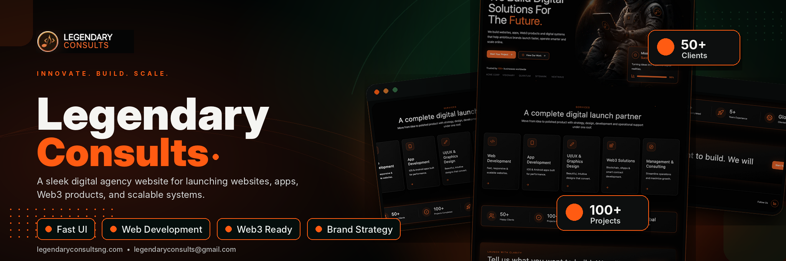

# Legendary Consults



Legendary Consults is a premium, futuristic digital agency website built with Next.js. It presents a conversion-focused landing page, service pages, portfolio case studies, blog content, project inquiry forms, Web3 positioning, and a smooth dark/light theme system.

## Overview

This project is designed by Legendary Consults a modern digital agency that builds websites, apps, Web3 products, design systems, and consulting solutions. The visual identity uses a dark space-inspired interface, orange brand accents, glassmorphism cards, responsive layouts, and motion-driven interactions.

The app is built as a complete website, not a static poster. Navigation, service cards, portfolio links, contact actions, lead forms, blog routes, and theme controls are all wired into real user journeys.

## Features

- Premium responsive landing page
- Dark futuristic astronaut-inspired design
- Light mode toggle with localStorage persistence
- Smooth Framer Motion animations
- Services dropdown navigation
- Mobile slide-in menu
- Start Project inquiry form
- Contact form with WhatsApp submission behavior
- Portfolio page with filters
- Case study detail pages
- Blog listing and dynamic blog detail pages
- Dedicated Web3 landing page
- Individual service pages with offerings, process, benefits, tools, and FAQ
- Accessible links, buttons, focus states, and semantic page structure

## Tech Stack

- Next.js App Router
- React
- TypeScript
- Tailwind CSS
- Framer Motion
- lucide-react
- Sharp for generating the README thumbnail

## Pages And Routes

| Route              | Purpose                             |
| ------------------ | ----------------------------------- |
| `/`                | Main landing page                   |
| `/start-project`   | Project inquiry form                |
| `/contact`         | Contact and strategy call page      |
| `/about`           | Agency story, values, and process   |
| `/work`            | Portfolio and case studies          |
| `/work/[slug]`     | Dynamic case study detail pages     |
| `/web3`            | Dedicated Web3 service landing page |
| `/blog`            | Blog listing with premium hero      |
| `/blog/[slug]`     | Dynamic blog article pages          |
| `/services/[slug]` | Dynamic service detail pages        |

## Getting Started

Install dependencies:

```bash
npm install
```

Run the development server:

```bash
npm run dev
```

Open the local URL shown in the terminal, usually:

```txt
http://localhost:3000
```

Build for production:

```bash
npm run build
```

Start the production server after building:

```bash
npm run start
```

## Project Structure

```txt
app/
  page.tsx                 Home page
  layout.tsx               Root layout and theme provider wrapper
  globals.css              Global styles and theme colors
  blog/                    Blog list and blog detail routes
  work/                    Portfolio and case study routes
  services/                Service detail routes
  start-project/           Lead capture page
  contact/                 Contact page
  about/                   Agency information page
  web3/                    Web3 landing page

components/
  site-chrome.tsx          Header, navigation, mobile menu, footer
  home.tsx                 Home page hero, services, stats, CTA
  blog-hero.tsx            Premium blog hero section
  ui.tsx                   Shared buttons, reveal animations, forms
  theme-provider.tsx       Theme state and toggle behavior
  theme-script.tsx         Early theme initialization script

lib/
  data.ts                  Services, stats, posts, portfolio data

public/
  astronaut-hero.png       Hero visual asset
  legendary-logo.jpg       Brand logo
  readme-assets/           README thumbnail assets

scripts/
  generate-readme-thumbnail.mjs
```

## Theme System

The app supports dark and light mode.

The theme system lives in `components/theme-provider.tsx`. It stores the selected theme in React state and saves it to localStorage using the key:

```txt
legendary-consults-theme
```

The selected theme is applied to the root HTML element with:

```html
<html data-theme="light"></html>
```

or:

```html
<html data-theme="dark"></html>
```

Global theme colors are controlled in `app/globals.css` with CSS variables. This makes the theme easier to maintain and extend.

## Forms And Contact Behavior

Project and contact forms validate required fields before submission. After validation, the entered details are formatted into a readable WhatsApp message and opened through:

```txt
https://wa.me/2348135744156
```

The strategy call button uses:

```txt
tel:08135744156
```

## README Thumbnail

The README thumbnail is generated from a custom SVG template inspired by the provided Cally-Pay thumbnail layout. It uses Legendary Consults branding, orange accents, astronaut imagery, and browser-style product panels.

Regenerate the thumbnail with:

```bash
node scripts/generate-readme-thumbnail.mjs
```

Generated files:

```txt
public/readme-assets/legendary-consults-thumbnail.svg
public/readme-assets/legendary-consults-thumbnail.png
```

## Customization

Edit agency content in:

```txt
lib/data.ts
```

Update global colors and theme tokens in:

```txt
app/globals.css
```

Update the header, navigation, and footer in:

```txt
components/site-chrome.tsx
```

Update the main landing page sections in:

```txt
components/home.tsx
```

Update the blog hero in:

```txt
components/blog-hero.tsx
```

## Production Checklist

Before deploying:

- Run `npm run build`
- Test desktop, tablet, and mobile layouts
- Check all navigation links
- Submit forms and confirm WhatsApp messages open correctly
- Test the theme toggle and refresh persistence
- Review portfolio external links
- Replace placeholder case studies and blog content with real content
- Confirm logo and imagery are optimized

## License

This project is create by Legendary Consults.
